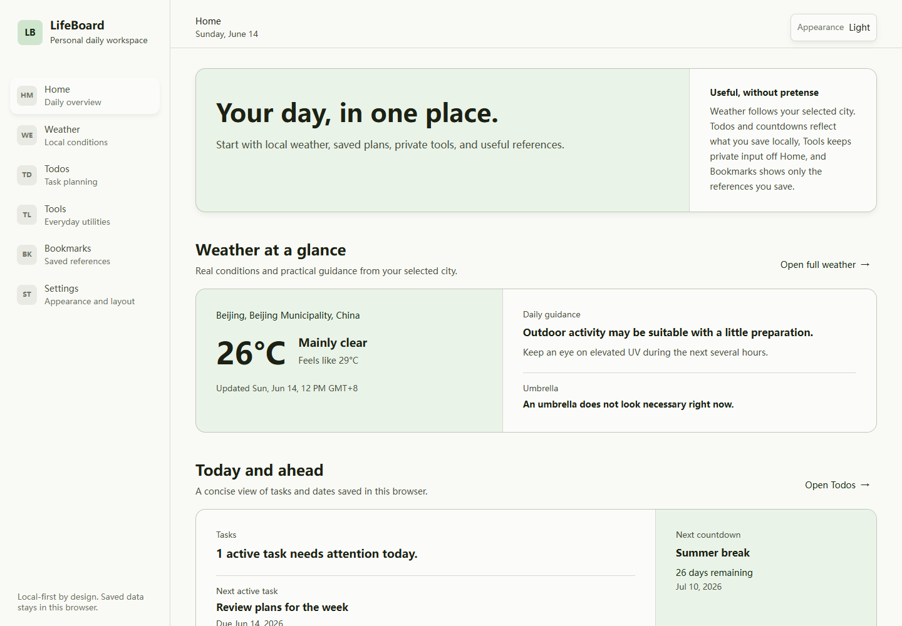
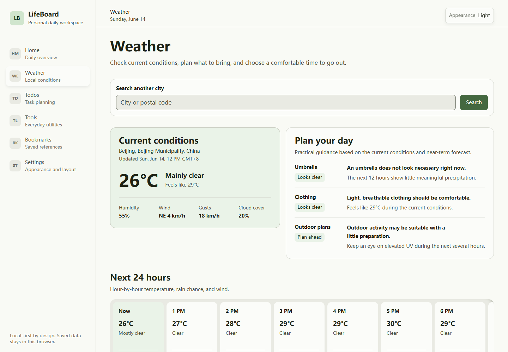
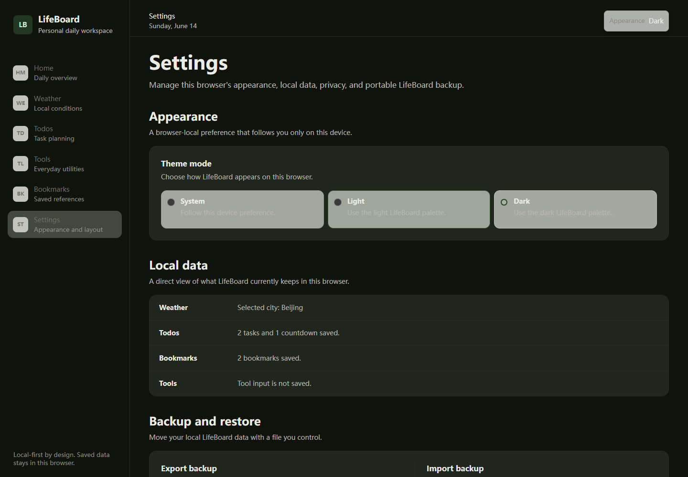

# LifeBoard

LifeBoard is a local-first personal life workspace for checking daily context, planning small tasks, using private browser tools, and keeping useful references together.

Repository: https://github.com/HuanHren/LifeBoard

## Screenshots

| Home | Weather |
| --- | --- |
|  |  |



## Features

- **Home**: calm summaries and direct entry points for connected modules
- **Weather**: city search, current conditions, 24-hour forecast, 7-day outlook, and practical daily advice
- **Todos and Countdowns**: create, edit, complete, filter, and locally persist tasks and important dates
- **Tools**: JSON formatting, timestamp conversion, text cleanup, line deduplication, case conversion, and text counting
- **Bookmarks**: locally save, categorize, search, edit, pin, and remove useful links
- **Settings**: theme controls, local data status, backup, restore, privacy information, and selective data clearing
- **Languages**: built-in Simplified Chinese and US English with a local translation-source export
- **Not Found**: a clear recovery page for unknown routes

## Tech Stack

- Vue 3 with `<script setup lang="ts">`
- TypeScript
- Vite
- Vue Router
- Pinia
- Tailwind CSS v4
- CSS variables and OKLCH design tokens

## Privacy And External Services

LifeBoard is local-first. It has no accounts, backend, analytics, cloud sync, or mobile application.

Open-Meteo is the only external service. It is used for city geocoding and weather forecasts and does not require an API key.

Interface translation is bundled locally. LifeBoard does not use a machine translation API.

LifeBoard stores these values in the current browser:

- Theme preference
- Selected weather city
- Todos and countdowns
- Bookmarks

Tools input is processed in memory and is not persisted. Forecast response data is not included in backups.

## Backup And Restore

Settings can export a JSON backup containing the LifeBoard-owned local data listed above. Import validates the file before replacing current local data. Restore operations use the existing storage formats and roll back if a browser storage write fails.

Backups are user-controlled files. LifeBoard does not upload them.

## Local Setup

Requirements:

- Node.js compatible with Vite 8
- npm

```bash
git clone https://github.com/HuanHren/LifeBoard.git
cd LifeBoard
npm install
```

Start the development server:

```bash
npm run dev
```

Create a production build:

```bash
npm run build
```

Preview the production build locally:

```bash
npm run preview
```

## Project Structure

```text
src/
  app/                 Application entry composition
  assets/styles/       Global styles and design tokens
  components/
    base/              Shared UI primitives
    layout/            App shell, sidebar, topbar, and mobile navigation
  modules/
    home/              Daily overview
    weather/           Open-Meteo service, store, advice, and forecast UI
    todos/             Tasks, countdowns, and local persistence
    tools/             Isolated browser utility workspaces
    bookmarks/         Saved-link management and local persistence
    settings/          Theme, backup, restore, privacy, and data clearing
    not-found/         Unknown-route recovery
  router/              Vue Router configuration
  stores/              Cross-app Pinia stores
  shared/              Shared constants and types
```

## Deployment

### Vercel

Vercel is the configured deployment target.

1. Push the repository to GitHub.
2. Import `https://github.com/HuanHren/LifeBoard` into Vercel.
3. Use the Vite framework preset.
4. Use `npm run build` as the build command.
5. Use `dist` as the output directory.
6. Leave environment variables empty; LifeBoard does not require deployment secrets.

`vercel.json` rewrites direct requests to `index.html`, allowing Vue Router to preserve clean history-mode routes. After deployment, test direct access to `/`, `/weather`, `/todos`, `/tools`, `/bookmarks`, `/settings`, and `/missing-route`.

A custom domain can be connected from Vercel Project Settings > Domains after the project is imported.

### GitHub Pages

GitHub Pages is possible but is not configured in this repository. A project-site deployment would require a `/LifeBoard/` Vite base path and explicit handling for direct SPA route requests. GitHub Pages does not provide Vercel-style rewrites, so clean route refreshes require a `404.html` workaround or hash-based routing.

## Roadmap

- Add automated regression coverage for storage and module workflows
- Add deployment-domain metadata after a stable public URL exists
- Continue focused accessibility and browser compatibility verification

The roadmap does not include accounts or cloud sync unless the product direction changes.

## License

No license has been selected. Copyright remains with the repository owner unless a license file is added later.
